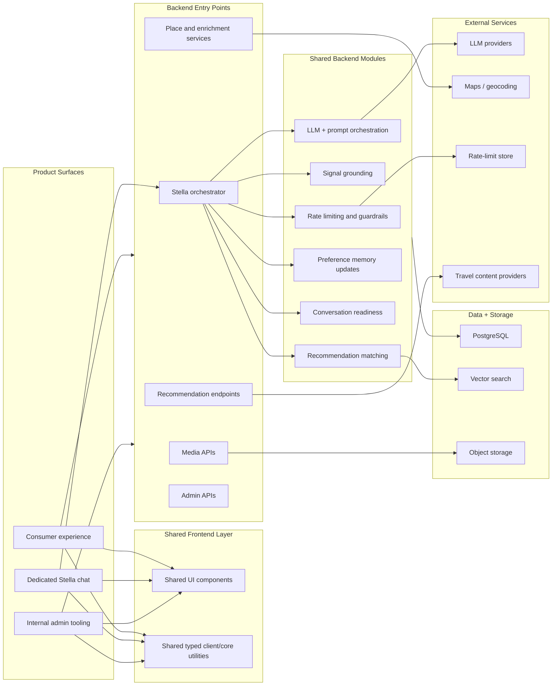
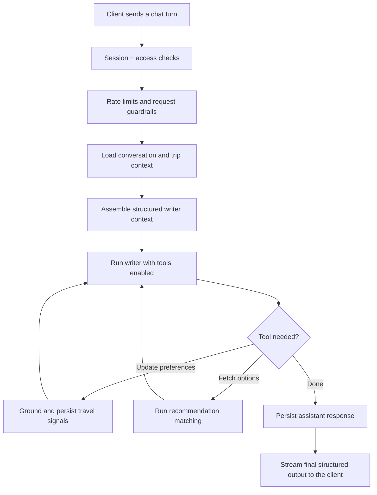

# Tripcerto Public

This repo hosts the public-facing Tripcerto surface at `tripcerto.com`: a B2B marketing landing page that explains the product to tour operators, DMCs, and travel agencies.

It is intentionally separate from the main Tripcerto product repo.

## What This Repo Hosts

- The public `tripcerto.com` landing page (single page, no routing)
- The brand surface (typography, colour tokens, basic static assets)

## What Stays In The Private Repo

The main Tripcerto product and operations stack lives in a separate private monorepo. That includes:

- The core consumer product surfaces
- The dedicated Stella chat experience
- Internal admin and curation tools
- Shared frontend packages
- Supabase edge functions
- The recommendation, enrichment, and media pipelines
- The underlying schema, matching logic, and operational tooling

## Why The Split Exists

The public repo is meant to stay small, safe to share, and easy to deploy. It gives Tripcerto a clean public-facing presence without exposing the full implementation details, internal tooling, or product code that powers the platform itself.

The private monorepo is where the actual application stack evolves. That is where Stella, recommendation orchestration, data modeling, media handling, and internal operator tooling are built and maintained.

In short:

- `tripcerto-public` explains the product
- The private Tripcerto monorepo runs the product

## System Overview

Tripcerto is a travel intelligence platform built around Stella, a conversational recommendation engine.

At a high level, the system does four things:

1. Accepts natural-language travel input
2. Turns that input into structured trip preferences
3. Matches those preferences against destinations, stays, and travel inventory
4. Streams recommendations and guidance back to the user

The key architectural idea is that Tripcerto does not treat each chat turn as an isolated prompt. It builds and updates structured trip memory over time, then uses that memory to improve subsequent recommendations.

## Architecture At A Glance



The detail intentionally stops short of implementation-level specifics, but the shape is important:

- Multiple product surfaces feed a shared backend platform
- The Stella orchestrator sits at the center of the recommendation experience
- Shared modules keep matching, grounding, readiness, and guardrails separated instead of collapsing everything into one handler

## Stella Orchestrator

The orchestrator is the part of the system worth highlighting because it is deliberately structured as a pipeline rather than a single monolithic prompt call.

At a high level, a turn works like this:



Why this matters:

- Session handling is separated from enrichment
- Enrichment is separated from prompt assembly
- Prompt assembly is separated from tool execution
- Tool execution is separated from persistence

That structure makes the recommendation flow easier to reason about, safer to extend, and much less fragile than a single oversized chat handler.

## Memory And Matching Model

Tripcerto uses structured preference memory rather than relying on one-shot prompting.

In practice, that means the system can:

- Carry preferences forward across a conversation
- Distinguish trip-wide preferences from leg-specific context
- Update recommendations as the user becomes more specific
- Use explicit positive and negative feedback to refine later results

This is the core product behavior behind Stella: conversation becomes reusable trip context rather than disposable chat history.

## This Repo's Stack

The public site is intentionally minimal:

- React 19 + TypeScript (strict)
- Vite 7
- No framework, no UI library, no Tailwind — design tokens live in `src/index.css` as CSS variables
- Deployed on Vercel (auto-deploy on push to `main`)

## Project Structure

```
src/
  App.tsx                # 9-section composition + useReveal()
  main.tsx               # React root
  index.css              # Cream design tokens + utility classes
  components/
    Nav.tsx, Hero.tsx, Problem.tsx (AssetChips, DelayStat),
    JourneySection.tsx (RelayFunnel),
    HowItWorksSection.tsx (LayerDiagram, VerticalsRow),
    DataControlSection.tsx (BoundaryDiagram),
    WhyNowSection.tsx, TeamSection.tsx, FAQ.tsx, PilotCTA.tsx, Footer.tsx,
    StatCard.tsx, MemberCard.tsx, diagram/ (DgmNode, DgmConnector, FanConnector),
    Threads.tsx, ShinyText.tsx, SoftAurora.tsx, icons.tsx
  hooks/    useReveal.ts # Scroll-in reveal (IntersectionObserver)
  lib/      analytics.ts # Vercel Analytics event tracking
public/
  favicon.*, apple-touch-icon.png, icon-192/512.png, site.webmanifest, og-image.png
index.html               # Document shell, fonts, cream meta/OG
```

## Local Development

```bash
npm install
npm run dev       # Vite dev server on http://localhost:5173
npm run build     # tsc -b && vite build
npm run lint      # eslint .
npm run preview   # serve dist/ locally
```

No runtime environment variables are required. See `.env.example`.

## Deployment

Vercel watches `main`. Push to `main` triggers a production build. PRs against `main` produce preview deployments.
