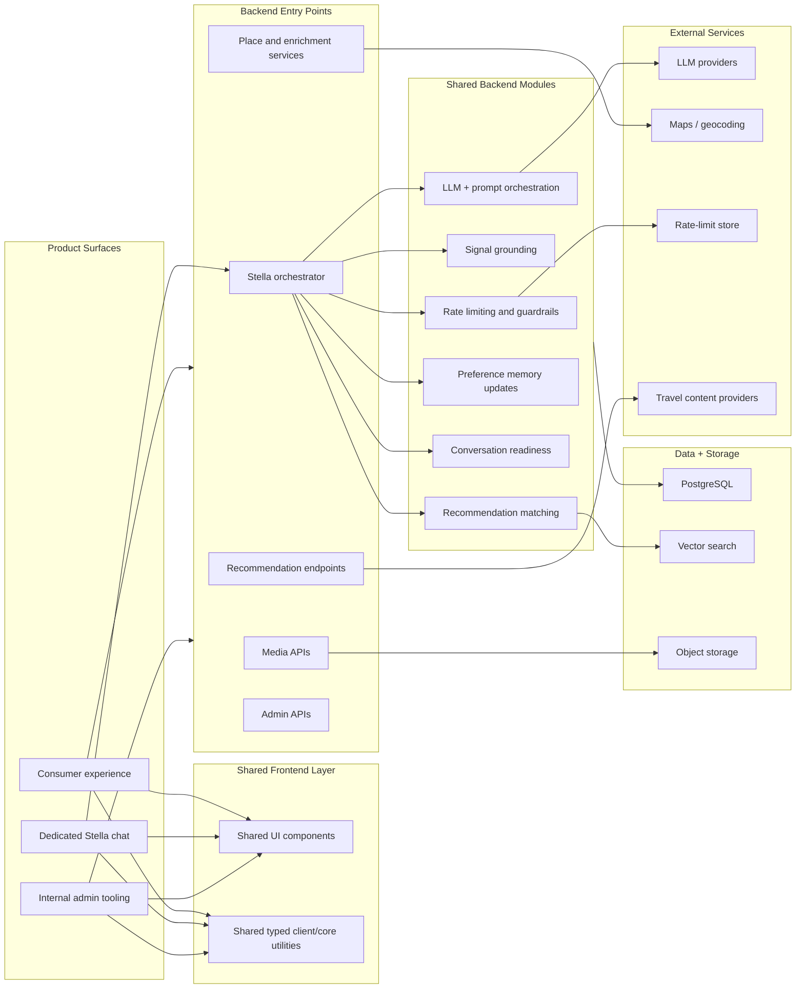
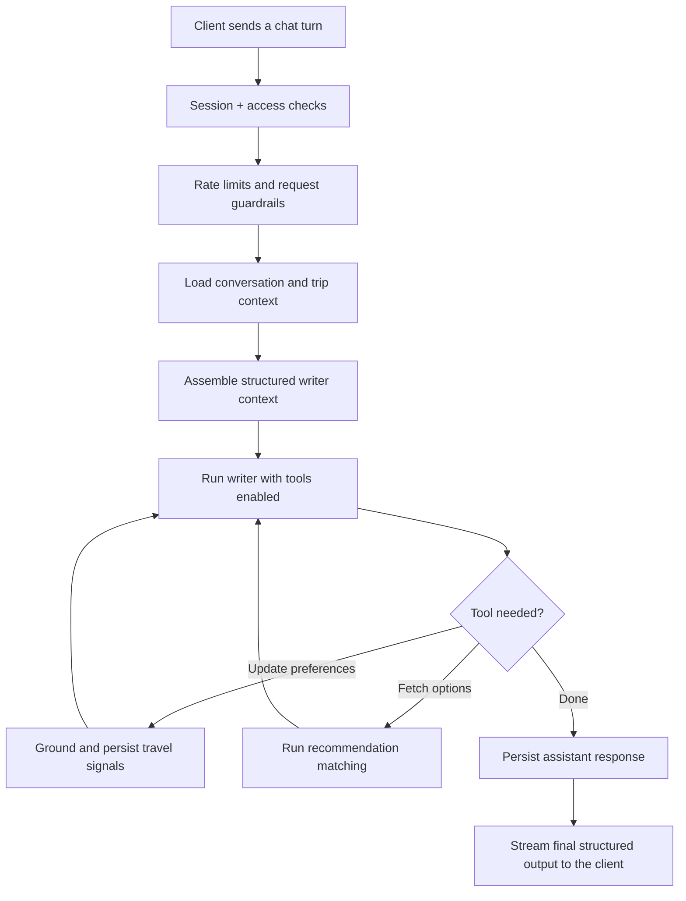

# Tripcerto Public

This repo hosts the public-facing Tripcerto surface: a lightweight domain used to explain the product at a high level and capture early interest.

It is intentionally separate from the main Tripcerto product repo.

## What This Repo Currently Hosts

- the public `tripcerto` landing domain
- a high-level overview of the Tripcerto system
- the public brand surface and basic static assets
- a simple Supabase-backed interest signup flow

## What Stays In The Private Repo

The main Tripcerto product and operations stack lives in a separate private monorepo. That includes:

- the core consumer product surfaces
- the dedicated Stella chat experience
- internal admin and curation tools
- shared frontend packages
- Supabase edge functions
- the recommendation, enrichment, and media pipelines
- the underlying schema, matching logic, and operational tooling

## Why The Split Exists

The public repo is meant to stay small, safe to share, and easy to deploy. It gives Tripcerto a clean public-facing presence without exposing the full implementation details, internal tooling, or product code that powers the platform itself.

The private monorepo is where the actual application stack evolves. That is where Stella, recommendation orchestration, data modeling, media handling, and internal operator tooling are built and maintained.

In short:

- `tripcerto-public` explains the product
- the private Tripcerto monorepo runs the product

## System Overview

Tripcerto is a travel intelligence platform built around Stella, a conversational recommendation engine.

At a high level, the system does four things:

1. accepts natural-language travel input
2. turns that input into structured trip preferences
3. matches those preferences against destinations, stays, and travel inventory
4. streams recommendations and guidance back to the user

The key architectural idea is that Tripcerto does not treat each chat turn as an isolated prompt. It builds and updates structured trip memory over time, then uses that memory to improve subsequent recommendations.

## Architecture At A Glance



The detail intentionally stops short of implementation-level specifics, but the shape is important:

- multiple product surfaces feed a shared backend platform
- the Stella orchestrator sits at the center of the recommendation experience
- shared modules keep matching, grounding, readiness, and guardrails separated instead of collapsing everything into one handler

## Stella Orchestrator

The orchestrator is the part of the system worth highlighting because it is deliberately structured as a pipeline rather than a single monolithic prompt call.

At a high level, a turn works like this:



Why this matters:

- session handling is separated from enrichment
- enrichment is separated from prompt assembly
- prompt assembly is separated from tool execution
- tool execution is separated from persistence

That structure makes the recommendation flow easier to reason about, safer to extend, and much less fragile than a single oversized chat handler.

## Shared Layers, Kept High Level

These layers live in the private monorepo, but they are useful to understand from a system-design perspective:

| Layer | High-level role |
| --- | --- |
| Shared UI | Reusable components and interface primitives used across product surfaces |
| Shared core/client utilities | Typed shared client logic and cross-surface helpers |
| Shared backend modules | Common orchestration building blocks such as grounding, matching, readiness, and provider abstraction |
| Media worker | Asynchronous processing for uploaded media and derivative generation |

The important point is not the file structure itself. It is the separation of responsibilities:

- UI concerns stay in shared frontend layers
- orchestration concerns stay in backend modules
- heavy media work stays off the request path

## Memory And Matching Model

Tripcerto uses structured preference memory rather than relying on one-shot prompting.

In practice, that means the system can:

- carry preferences forward across a conversation
- distinguish trip-wide preferences from leg-specific context
- update recommendations as the user becomes more specific
- use explicit positive and negative feedback to refine later results

This is the core product behavior behind Stella: conversation becomes reusable trip context rather than disposable chat history.

## Public Vs Private Deployment Split

The easiest way to think about the current setup is:

| Surface | Purpose |
| --- | --- |
| `tripcerto-public` | Public overview site and interest capture |
| Private Tripcerto monorepo | Product apps, shared packages, backend functions, data model, admin tools, and recommendation engine |

That split is deliberate.

The public repo should remain:

- lightweight
- easy to share
- easy to deploy
- low-risk from an operational and security perspective

The private repo can then carry the full product surface area without forcing that complexity into the public-facing site.

## Tech Summary

At a high level, the broader Tripcerto platform is built around:

- React frontend surfaces
- shared typed packages
- Supabase edge functions and PostgreSQL
- vector-backed retrieval and matching
- external providers for LLMs, maps, media, and travel content

This public repo, by contrast, is intentionally much smaller. It is just the public shell.

## Local Development

```bash
npm install
npm run dev
```

Environment variables are used for the public Supabase signup flow.
